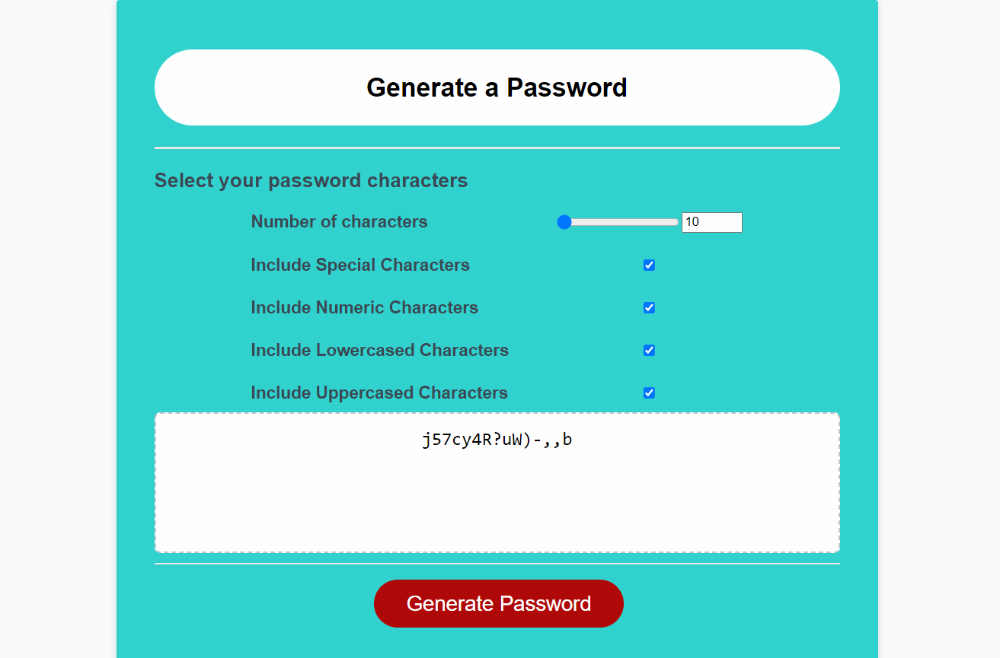

# Module 5 Challenge: Password Generator

## Overview

This week’s challenge we are required you to create an application that an employee can use to generate a random password based on criteria they’ve selected by modifying starter code. This app will run in the browser, and will feature dynamically updated HTML and CSS powered by JavaScript code that you write. It will have a clean and polished user interface that is responsive, ensuring that it adapts to multiple screen sizes.

The password is expected to include special characters

## Followed Instructions and expectation

* To Generate a password when the button is clicked
  * Present a series of prompts for password criteria
    * Length of password
      * At least 10 characters but no more than 64.
    * Character types
      * Lowercase
      * Uppercase
      * Numeric
      * Special characters ($@%&*, etc)
  * Code should validate for each input and at least one character type should be selected
  * Once prompts are answered then the password should be generated and displayed in an alert or written to the page

* For the application user experience is intuitive and easy to navigate.

* For the Application user interface style to be clean and polished.

The following image shows the web application's appearance and functionality:

[deployed link](https://lawzstopwar.github.io/Password-Generator/)

